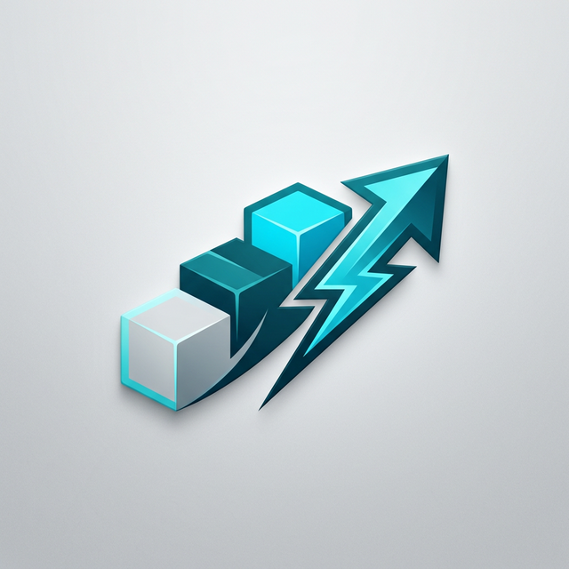

<div align="center">
  

  # **Inventário Ágil**
  ### *A próxima geração da gestão logística em tempo real.*

  [](#)
  [](#)
  [](https://nextjs.org/)
  [](https://firebase.google.com/docs/genkit)
</div>

---

## 📋 Sobre o Projeto

O **Inventário Ágil** é um piloto de sistema de WMS (Warehouse Management System) focado em **UX premium** e **regras operacionais em tempo real**. Ele resolve o gap entre a venda e a produção, garantindo que o estoque seja reservado no momento da negociação e que a produção seja acionada automaticamente quando necessário.

> [!IMPORTANT]
> Este projeto utiliza uma arquitetura híbrida (Local-First + Cloud-Ready) para permitir testes rápidos sem depender de infraestrutura complexa de backend na fase piloto.

---

## ✨ Principais Funcionalidades

### 🛒 Gestão de Pedidos & Reservas
- **Reserva Inteligente**: Bloqueio automático de estoque no `onblur` do campo de quantidade.
- **Heartbeat de Reserva**: TTL de 5 minutos com renovação automática durante a edição.
- **Transparência de Estoque**: Visualização clara de `onHand`, `reservedTotal`, `available` e `qtyToProduce`.

### 🏭 Produção & MRP (IA-Powered)
- **Sugestão de Reposição**: IA integrada (Genkit/Gemini) analisa consumo histórico e lead time para prever necessidades.
- **Fluxo de Produção**: Geração automática de tarefas para itens sem estoque imediato.
- **Conferência de Entrada**: Sistema de `Receipt DRAFT` para validação de entrada física pelo operador.

### 📦 Logística & Picking
- **Fila de Separação**: Priorização por `READY_FULL` ou `READY_PARTIAL`.
- **Etiquetas QR**: Geração dinâmica de etiquetas em PDF para volumes, facilitando o rastreio.
- **Trilha de Auditoria**: Histórico completo de impressões e alterações de status.

---

## 🚀 Como Rodar o Projeto

### Pré-requisitos
- **Node.js**: v18+ (Recomendado v20.x+)
- **NPM**: v10+

### Instalação e Inicialização

```bash
# 1. Instale as dependências
npm install

# 2. Configure o banco de dados (PG Local ou Docker)
# Certifique-se de que o .env esteja configurado
npm run db:migrate

# 3. Carregue os dados iniciais (Seed)
node scripts/seed-legacy-materials.js
node scripts/seed-operators.js

# 4. Inicie o servidor de desenvolvimento
npm run dev
```

Acesse em: [http://localhost:3000](http://localhost:3000)

---

## ✅ Checklist de Configuração Rápida

Para garantir que o ambiente está 100% operacional:

- [ ] Arquivo `.env` criado a partir do `.env.example`.
- [ ] Conexão com PostgreSQL ativa (`DATABASE_URL`).
- [ ] Conexão com Redis ativa (`REDIS_HOST`).
- [ ] Executado `npm run db:migrate` para as tabelas de MRP e Receipts.
- [ ] Materiais de teste carregados via `node scripts/seed-legacy-materials.js`.
- [ ] Operadores criados via `node scripts/seed-operators.js`.

---

## 🏗 Arquitetura & Stack Tecnológica

O sistema foi construído utilizando as tecnologias mais modernas do ecossistema Web:

- **Frontend**: [Next.js 15+](https://nextjs.org/), [React 19](https://react.dev/)
- **Styling**: [Tailwind CSS](https://tailwindcss.com/) com design system via [Radix UI](https://www.radix-ui.com/)
- **State**: [Zustand](https://zustand-demo.pmnd.rs/) (Offline-first & Persistence)
- **IA/ML**: [Genkit AI](https://firebase.google.com/docs/genkit) + Google Gemini
- **Database**: PostgreSQL (PG) & Redis (Cache/Signals)
- **Documentos**: [jsPDF](http://raw.githack.com/MrRio/jsPDF/master/docs/index.html) + [QRCode.js](https://github.com/davidshimjs/qrcodejs)

Para mais detalhes, veja a [Documentação de Arquitetura](./docs/ARCHITECTURE.md).

---

## 🛠 Comandos de Qualidade & Produção

| Comando | Descrição |
| :--- | :--- |
| `npm run typecheck` | Validação estática de tipos com TypeScript |
| `npm run lint` | Verificação de padrões de código com ESLint |
| `npm run build` | Geração do bundle otimizado para produção |
| `npm run pm2:start` | Inicializa a aplicação via PM2 em modo cluster |

---

## 🗺 Roadmap

- [x] **Fase 1: Piloto Operacional** - UX Completa, Reservas locais, Fluxo Picking.
- [ ] **Fase 2: Integração Cloud** - Migração total para Firestore/Cloud Functions.
- [ ] **Fase 3: Inteligência Preditiva** - Refinamento das heurísticas de MRP via IA.
- [ ] **Fase 4: Mobile App** - App dedicado para coletores de dados via PWA.

---

## 📖 Documentação Detalhada

Explore mais informações sobre o funcionamento interno:

- [🏗 Arquitetura do Sistema](./docs/ARCHITECTURE.md) - Visão técnica e diagramas.
- [🔗 Referência da API](./docs/API.md) - Endpoints e estrutura de dados.
- [🔐 Configuração de Ambiente](./docs/ENVIRONMENT.md) - Guia de variáveis `.env`.
- [💾 Guia de Scripts](./docs/SCRIPTS.md) - Utilitários para dev e ops.
- [🩺 Troubleshooting](./docs/TROUBLESHOOTING.md) - Soluções de problemas comuns.
- [📜 Histórico de Commits](./HISTORY.md) - Registro detalhado de cada code change.
- [🤝 Guia de Contribuição](./CONTRIBUTING.md) - Como participar do projeto.
- [📜 Blueprint Original](./docs/blueprint.md) - Requisitos e regras de negócio.

---

## ⚖️ Licença & Governança

- **Licença**: [MIT](./LICENSE)
- **Segurança**: [SECURITY.md](./SECURITY.md)
- **Histórico**: [CHANGELOG.md](./CHANGELOG.md)

---

<p align="center">
  Desenvolvido com foco em eficiência e experiência do usuário.
</p>
