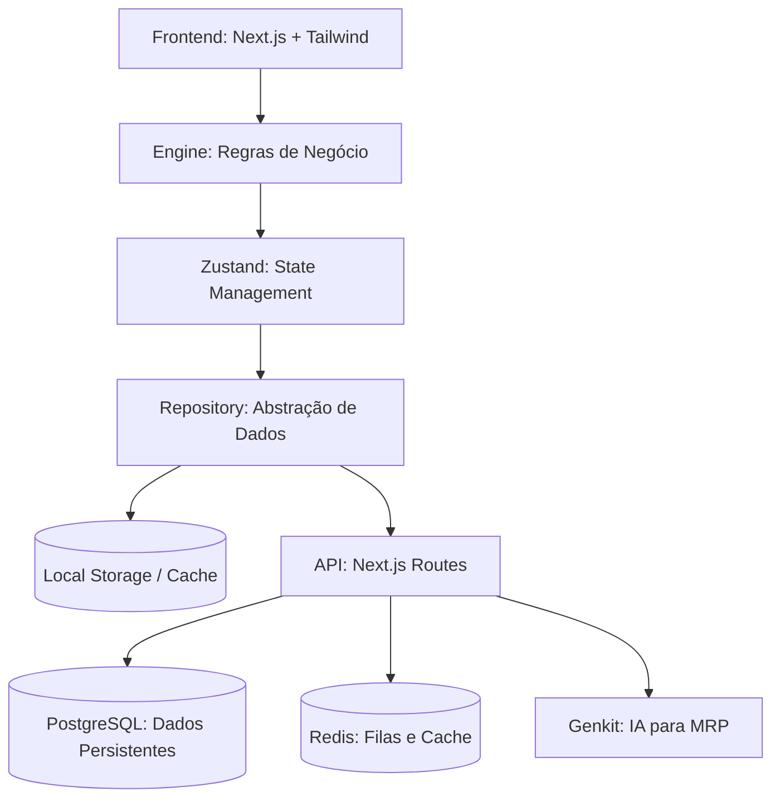

# Arquitetura do Sistema: Inventário Ágil

Este documento detalha o design e a estrutura técnica por trás do **Inventário Ágil**. O sistema foi concebido para ser altamente responsivo, suportar operações offline-first (em certas camadas) e permitir uma transição suave para um backend cloud.

## 🏗 Visão Geral da Arquitetura

O sistema segue uma abordagem de **Clean Architecture** mínima, desacoplando a lógica de negócio (Engine) da persistência de dados (Repositories/Contracts).

### Diagrama de Blocos

## 🛠 Componentes Principais

### 1. Camada de Contratos (`src/lib/pilot/contracts.ts`)
Define as interfaces para todas as entidades (Material, Order, Stock, etc.). Isso permite que a UI não precise saber se os dados vêm de uma API ou de um banco local.

### 2. Motor de Reservas (Reservations Engine)
Implementa a lógica de reserva "soft" e "hard".
- **Soft Reservation**: Ocorre no `blur` de um campo de quantidade no pedido.
- **TTL (Time to Live)**: Reservas expiram em 5 minutos se não houver atividade (heartbeat).
- **Consistência**: Garante que o `available` estoque seja calculado em tempo real: `onHand - reservedTotal`.

### 3. MRP (Material Requirements Planning)
Utiliza IA (via Genkit/Gemini) para analisar:
- Histórico de consumo das últimas 4 semanas.
- Lead time dos materiais.
- Estoque atual vs. Ponto de pedido.
- **Fluxo**: IA gera sugestões -> Gestor revisa -> Ordem de Produção é criada.

### 4. Fluxo de Produção para Estoque (IN/OUT)
Separamos a conclusão da produção da entrada física no estoque:
1. **Produção**: Operador conclui a tarefa.
2. **Receipt DRAFT**: O sistema gera um documento de entrada pendente.
3. **Alocação**: O operador de entrada (Inbox) confirma a entrada e decide se a quantidade deve ser auto-alocada para pedidos em espera (`READY_FULL` / `READY_PARTIAL`).

## 📊 Modelo de Dados (PostgreSQL)

Atualmente gerenciado via tabelas para:
- `mrp_suggestions`: Armazena insights da IA.
- `inventory_receipts`: Controle de entradas.
- `production_tasks`: Gerenciamento de fila de fábrica.

## 🚀 Estratégia de Deploy

- **PM2**: Utilizado para gerenciar instâncias em servidores Linux/Windows.
- **Cluster Mode**: Maximiza o uso de CPU.
- **Scripts**: `npm run pm2:start` inicia o processo com as configurações em `ecosystem.config.js`.

---
Consulte o arquivo [blueprint.md](./blueprint.md) para os requisitos originais de design.
